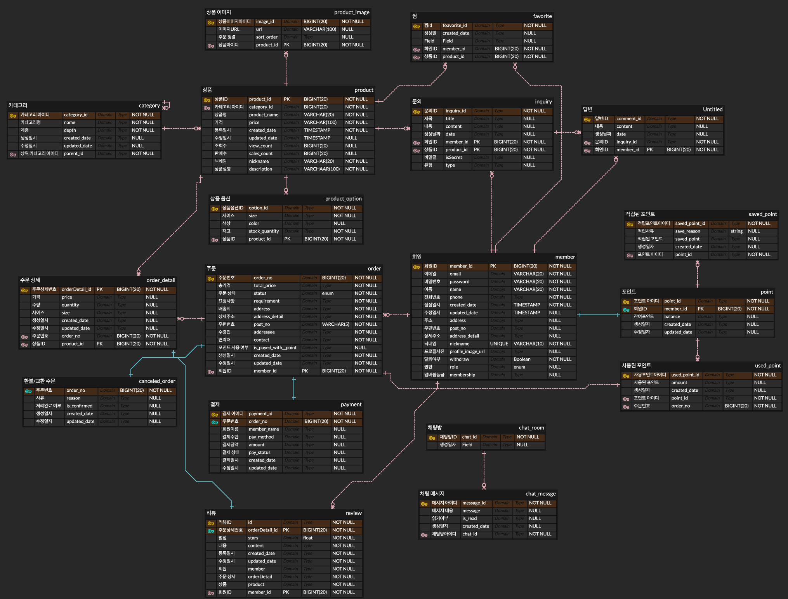
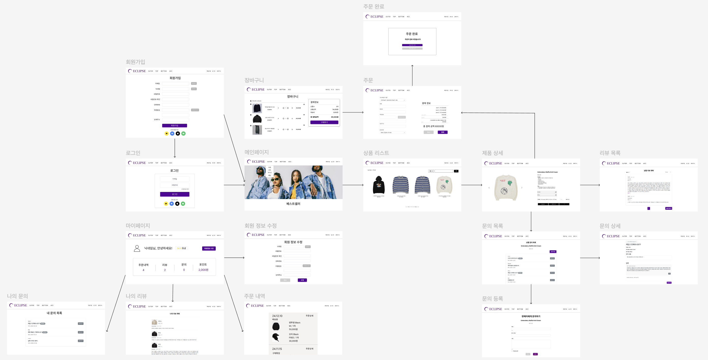

## 💬 설명

> 엘리스 Cloud 트랙 5기 2차 프로젝트 의류 쇼핑몰 Eclipse입니다.
 

## ⚙️ 기술 스택

### 백엔드

### 프론트엔드

  

## 🧩 ERD

  

## ⛓️ 와이어 프레임

  

## 🔥 주요기능

### **1. 회원**

- **회원가입**
    - 이메일 형식 아이디
    - 이메일, 닉네임 중복검사
    - 비밀번호, 전화번호 유효성검사
    - OAUTH
        - 구글
- **마이 페이지**
    - 포인트
        - 포인트 적립/사용 내역 확인 가능
    - 주문 내역
        - 상품 준비중, 배송시작, 배송완료 등
    - 리뷰
        - 작성한 리뷰 확인 가능
    - 문의
        - 작성한 문의 확인 가능
    - 찜한 상품
        - 관심(좋아요): 관심있는 상품 저장
    - 내 정보 수정
        - 비밀번호
            - 수정 전 현재 비밀번호 검증
        - 전화번호
        - 닉네임
        - 주소
- **권한**
    - 일반 회원
    - 관리자
        - 모든 회원의 주문 내역, 회원 정보 조회 가능
        - 배송 상태 변경
        - 상품 및 카테고리 추가 가능
        - 회원 권한 변경 가능, 회원 삭제 가능
        - 비밀글 열람 가능/문의에 답글 달기 가능
- **로그인**
    - 로그인시 쿠키에 JWT토큰 발급
    - 이메일 주소를 입력하여 비밀번호 찾기
- **보안**
    - XSS 공격 방어를 위한 httpOnly 설정
    - CSRF 공격 방어를 위한 SameSite를 Lax로 설정
- **멤버십 등급**
    - 브론즈
        - 기본 등급
    - 실버
        - 전월 결제금액 20만원 이상
        - 매월 5000포인트 지급
    - 골드
        - 전월 결제금액 50만원 이상
        - 매월 10000포인트 지급
    - 다이아몬드
        - 전월 결제 금액 100만원 이상
        - 매월 50000포인트 지급

### **2. 카테고리**
- **카테고리 전체 조회**
    - 카테고리명, 해당 카테고리의 상품 수
- **카테고리 추가**
    - 메인 카테고리 추가 - 메인 카테고리명 중복 불가
    - 메인 카테고리 추가 시 서브 카테고리 1개 같이 추가
    - 서브 카테고리 추가 - 해당 메인 카테고리 내 서브 카테고리명 중복 불가
    - 카테고리명 공백 불가, 1-15자 제한, 한글, 영어 대소문자, / 가능
- **카테고리 수정**
- **카테고리 삭제**
    - 해당 카테고리에 상품이 존재하는 경우 삭제 불가
### **3. 상품**

- **카테고리화**
    - 장소, 항목 카테고리 분류 (ex 상의-니트/스웨터)
- **상품 상세**
    - 사이즈
    - 색상
    - 제조사
- **상품 목록 정렬**
    - 최신순(default)
    - 조회수 순
    - 평점 높은/낮은순
    - 가격 높은/낮은순

### **4. 장바구니**
- 주문은 장바구니를 통해서만 가능
- 수량 조정, 일부 삭제, 전체 삭제
- 장바구니에서 상품 옵션 변경 가능

### **5. 결제**
- 주문과 결제는 별도의 도메인으로 구분
- 주문 데이터 생성 이후 결제 요청, 결제 실패시 결제 데이터는 생성되지 않음
- PortOne API를 활용해 실제 결제 로직을 구현

### **6. 주문**
- **결제수단**
    - PortOne API를 통해 다양한 플랫폼에서의 결제
    - 포인트 결제
        - 1원 단위로 자유롭게 사용 가능
- **배송**
    - 주소는 우편번호, 도로명 주소, 상세주소로 구성
    - 요청사항은 선택사항으로 입력
    - 회원 가입시 입력했던 배송지를 기본 배송지로 사용 가능
    - 50,000원 이상 구매 시 배송비 무료
- **환불 요청**
    - 주문 상태가 신규 주문일 때에만 가능
    - 사용자가 환불 요청을 할 시에 환불 사유와 함께 주문 상태가 환불 요청으로 변경
    - 관리자는 환불 요청 받은 주문을 처리하거나 환불 요청 처리 자체를 취소할 수 있음
- **주문 조회**
    - 주문한 상품 명으로 검색 가능
    - 주문 상태가 목록에서 표시

### **7. 포인트**
- 결제시 포인트를 현금으로 사용 가능
- 구매 확정 시 상품 금액의 1%를 포인트로 적립
- 리뷰 작성 시 500P 적립
- 멤버십 등급에 따라 매월 포인트 혜택 지급

### **8. 리뷰**
- **리뷰 작성**
    - ‘구매 확정’된 주문 상세에 대해 리뷰 작성 가능
    - 1~5점 평점 선택 필수
    - 내용 20~500자 작성 필수
    - 리뷰 작성 시 500포인트 지급
- **상품별 리뷰 목록**
    - 상품의 전체 리뷰 조회
    - 최신순/높은 평점순/낮은 평점순 조회
    - 상품별 별점 평균 조회
    - 3줄 초과 시 더보기/줄이기 기능
- **나의 리뷰 조회**
    - 해당 회원이 작성한 리뷰 조회
    - 3줄 초과 시 더보기/줄이기 기능

### **9. 문의**
- **상품별 문의 목록**
    - 상품의 전체 문의 조회
    - 비밀글로 설정한 문의는 ‘비밀글입니다’로 표시, 상세보기 불가
    - 답변이 작성된 문의는 답변완료 배지 표시
- **문의 작성**
    - 사이즈, 재입고, 배송, 상품상세 중 유형 옵션 선택
    - 체크박스로 비밀글 여부 설정
- **문의 상세**
    - 문의 작성자만 문의 삭제 가능
    - 관리자만 문의에 답변 작성 가능
- **나의 문의 조회**
    - 자신이 작성한 문의만 조회
    - 답변이 작성된 문의는 답변완료 배지 표시

### **10. 채팅**
- **버튼식 상담**
    - 정해진 질문에는 자동 답변
    - 상담 내역은 Local Storage 저장
- **1:1 상담**
    - 상담사 연결 버튼을 누르면 ADMIN 페이지로 요청 전송
    - 요청이 수락되면 1:1 상담 시작

  
# 👀 실행 화면
  
# 🛠️ 커밋 컨벤션

* 타입은 태그와 제목으로 구성되고, 태그는 영어로 쓰되 첫 문자는 대문자로 한다.
* "태그: 제목"의 형태이며, : 뒤에만 공백이 있음에 유의

|  태그 이름   |                설명                |
|:--------:|:--------------------------------:|
|   Feat   |          새로운 기능을 추가할 경우          |
|   Fix    |            버그를 고친 경우             |
|  Design  |       CSS 등 사용자 UI 디자인 변경        |
|  Style   | 코드 포맷 변경, 세미 콜론 누락, 코드 수정이 없는 경우 |
| Refactor |           프로덕션 코드 리팩토링           |
|   Docs   |           	문서를 수정한 경우            |
|  Rename  |     	파일 or 폴더명 수정하거나 옮기는 경우      |    
